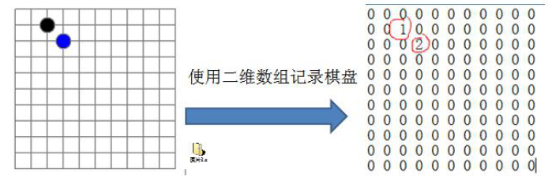
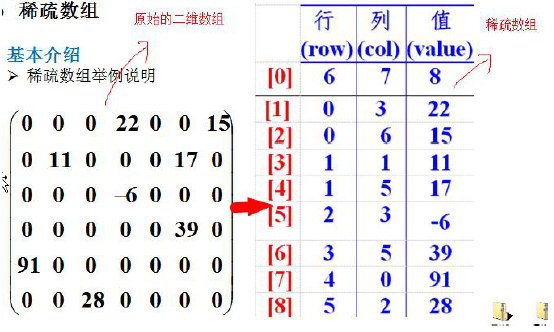
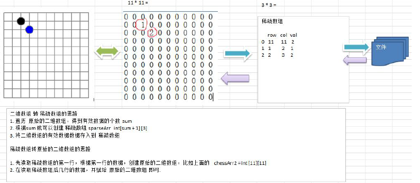
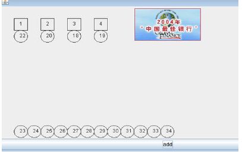
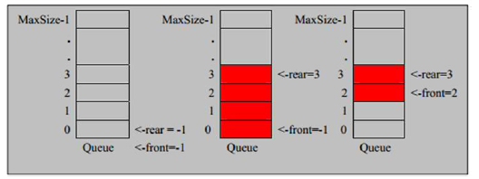

# 第1章  稀疏数组和队列

[toc]

## 1.1 稀疏数组 sparsearray 数组

### 1.1.1 需求

数组压缩算法




### 1.1.2 稀疏数组的思想

数组 –> 稀疏数组



- 第一行：原始数组几行几列，多少个非0值
- 每一行：非0值的行列


### 1.1.3 原理剖析：数组<—>稀疏数组




### 1.1.4 代码实现

```java
/**
 * 稀疏数组
 */
public class SparseArray {
    public static void main(String[] args) {

        /**
         * 创建原始数据
         */
        int[][] chessArray = new int[11][11];
        chessArray[1][2] = 1;
        chessArray[2][3] = 2;
        System.out.println("===原始二维数据===");
        for (int[] row : chessArray) {
            for (int data : row) {
                System.out.printf("%d ", data);
            }
            System.out.println();
        }


        /**
         * 二维数组转稀疏数组
         *  1、先遍历二维数组，得到非0数据的个数
         *  2、创建对应的稀疏数组
         *  3、稀疏数组赋值
         */
        int sum = 0;
        for (int[] row : chessArray) {
            for (int data : row) {
                if(data != 0){
                    sum++;
                }
            }
        }

        int[][] sparsearray = new int[sum + 1][3];
        // 给稀疏数组赋值
        sparsearray[0][0] = 11; // 二维数组的行数
        sparsearray[0][1] = 11; // 二维数据的列数
        sparsearray[0][2] = sum; // 二维数组的非0值个数

        // 遍历二维数组，将非0值存在稀疏数组中
        int count = 0; // 记录第几个非0值
        for (int i = 0; i < 11; i++) {
            for (int j = 0; j < 11; j++) {
                if(chessArray[i][j] != 0){
                    // 赋值
                    count++;
                    sparsearray[count][0] = i; // 行
                    sparsearray[count][1] = j; // 列
                    sparsearray[count][2] = chessArray[i][j]; // 值
                }
            }
        }

        System.out.println("===稀疏数组===");
        for (int[] row : sparsearray) {
            for (int data : row) {
                System.out.printf("%d ", data);
            }
            System.out.println();
        }


        /**
         * 稀疏数组转为二维数组
         *  1、读取行和列
         *  2、遍历稀疏数组进行取值
         */
        int[][] sparse2array = new int[sparsearray[0][0]][sparsearray[0][1]];
        for(int k = 1; k < sparsearray.length; k++){
            sparse2array[sparsearray[k][0]][sparsearray[k][1]] = sparsearray[k][2];
        }

        System.out.println("===二维数组===");
        for (int[] rowdata : sparse2array) {
            for (int data : rowdata) {
                System.out.printf("%d ", data);
            }
            System.out.println();
        }
    }
}
```


## 1.2 队列

### 1.2.1 场景

银行排队




### 1.2.2 队列介绍

- 先入先出
- ==数组==         ==链表==

### 1.2.3 数组模拟一次性队列

#### 1. 原理剖析



- 队列本身是有序列表
- ==maxSize==是队列的最大容量
- 因为队列的输入输出分别从前后端来处理，因此需要两个变量==front==和==rear==分别记录队列前后端的下标。front会随着数据输出而改变，而rear则是虽则数据输入而改变
- 队列常用操作：
  - addQueue：加入队列
    - 将尾指针往后移：rear+1，当front==rear【空】
    - 若尾指针rear小于队列的最大下标 maxSize - 1，则将数据村塾rear所指的数组元素中，否则无法存入数据。 rear == maxSize - 1【队列满】


#### 2. 代码实现

```java
class ArrayQueue{
    private int maxSize; // 表示数组的最大容量

    private int front;  // 队列头

    private  int rear;  // 队列尾

    private int[] arr;  // 该数组用于存放数据，模拟队列

    // 创建队列的构造器
    public ArrayQueue(int maxSize){
        // 初始化工作
        this.maxSize = maxSize;
        arr = new int[maxSize];
        front = -1;  // 指向队列头部【数据的前一个位置】，并不包含数据，
        rear = -1;   // 指向队列尾部具体数据【就是队列最后一个数据】
    }

    // 判断队列是否满
    public boolean isFull(){
        return rear == maxSize - 1;
    }

    // 判断队列是否为空
    public boolean isEmpty(){
        return rear == front;
    }

    //添加数据到队列
    public void addQueue(int n){
        if(isFull()){
            System.out.println("队列已满，不能加入");
            return;
        }

        rear++;  // 尾指针rear向后移动
        arr[rear] = n; // 存入队列之中
    }

    // 从队列中获取数据
    public int getQueue(){
        // 从front取出数据
        if(isEmpty()){
            // 通过抛出异常进行处理
            throw new RuntimeException("队列已空，不能取出数据");
        }

        front++;  // front后移 -1 --> 0
        return arr[front];  // front指向队列头部的前一个数据
    }

    // 显示队列的所有数据
    public void showQueue(){
        if(isEmpty()){
            System.out.println("队列已空，没有数据");
            return;
        }

        for (int i = 0; i < arr.length; i++) {
            System.out.printf("arr[%d]=%d\n", i, arr[i]);
        }
    }

    // 显示队列头部数据，不是取出数据
    public int headQueue(){
        if(isEmpty()){
            throw new RuntimeException("队列已空，没有数据");
        }
        // front本身指向不改变
        return arr[front + 1]; // // front指向队列头部的前一个数据
    }
}
```

- 测试

```java
/**
 * 使用数组模拟简单队列
 *  1、编写ArrayQueue类
 */
public class SimpleQueue {

    public static void main(String[] args) {
        System.out.println("===测试ArrayQueue===");

        ArrayQueue arrayQueue = new ArrayQueue(3);
        char key = ' '; // 接受用户输入
        Scanner scanner = new Scanner(System.in);
        boolean loop = true;
        while (loop) {
            System.out.println("s(show): 显示队列");
            System.out.println("e(exit): 退出程序");
            System.out.println("a(add): 添加数据到队列");
            System.out.println("g(get): 从队列取出数据");
            System.out.println("h(head): 查看对头数据");


            // 接受一个字符
            key = scanner.next().charAt(0);
            switch (key) {
                case 's':
                    arrayQueue.showQueue();
                    break;
                case 'e':
                    loop = false;
                    scanner.close();
                    System.out.println("===程序退出===");
                    break;
                case 'a':
                    System.out.println("输入一个数：");
                    int num = scanner.nextInt();
                    arrayQueue.addQueue(num);
                    break;
                case 'g':
                    // 取数数据，会出现异常
                    try {
                        int queue = arrayQueue.getQueue();
                        System.out.println("取出的数据是：" + queue);
                    } catch (Exception e) {
                        System.out.println(e.getMessage());
                    }
                    break;
                case 'h':
                    try {
                        int headQueue = arrayQueue.headQueue();
                        System.out.println("查看队头数据：" + headQueue);
                    } catch (Exception e) {
                        System.out.println(e.getMessage());
                    }
                    break;
                default:
                    break;
            }
        }

    }
}
```

- 存在问题：数组只能使用一次


### 1.2.4 数组模拟环形队列

#### 1. 原理剖析


#### 2. 代码实现


