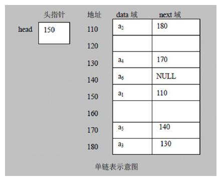
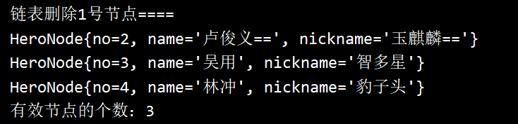
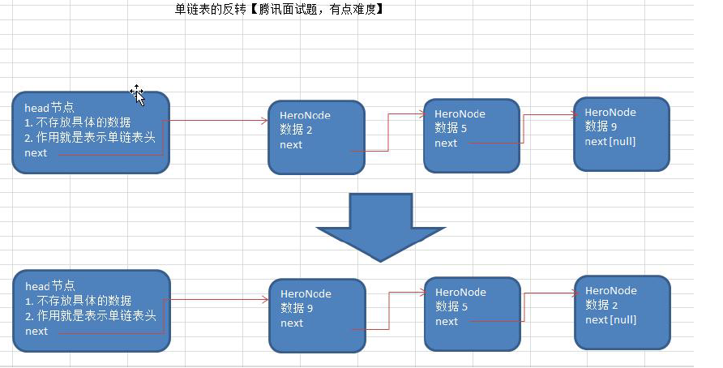
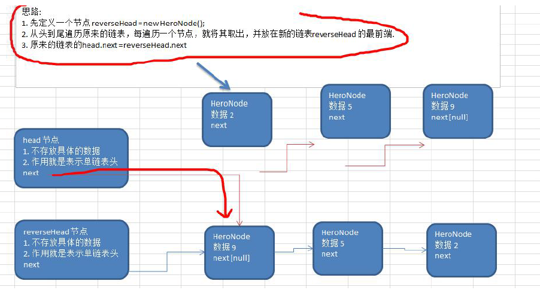
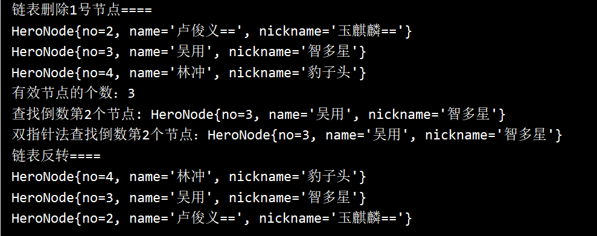
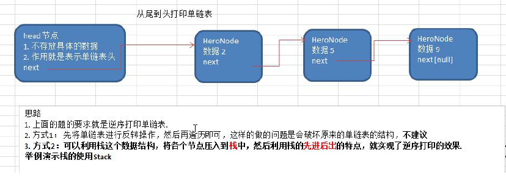
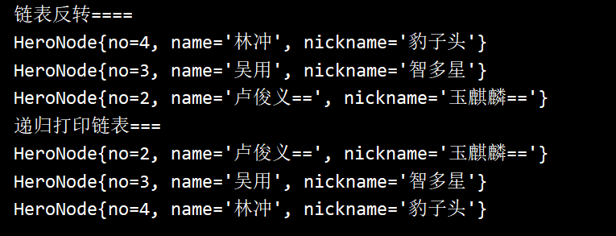
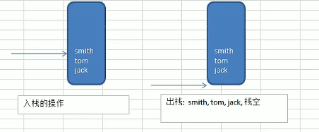
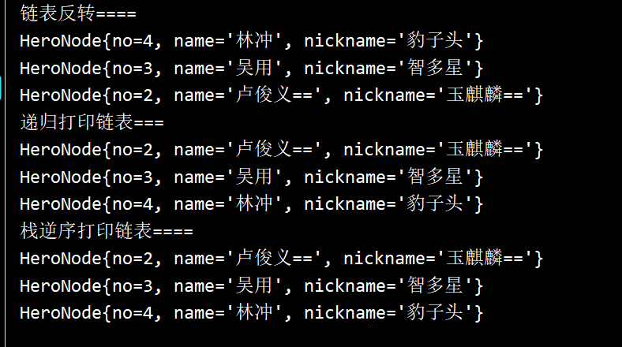

# 第2章  链表(Linked List)
[TOC]


## 2.1 单链表

### 2.1.1 链表的内存存储布局

**实际结构**



- 链表是以节点的方式存储，链式存储，并不是连续存储
- 链表分为带**头结点的链表**和**不带头结点的链表**，根据实际需求进行确定

单链表(带头结点)的**逻辑结构**


### 2.1.2 单链表需求

- 有序插入新数据

- 使用带head节点的单向链表的实现—水浒传英雄**排行榜管理**


### 2.1.3 单链表原理

#### 1. 无序单链表

==创建单链表，不考虑顺序，直接添加在链表的尾部==


#### 2. 有序单链表

按照number进行排序


#### 3. 删除节点


### 2.1.4 单链表实现

#### 1. 无序单链表

- 节点【java中全部是对象引用】

```java
// 定义Node,每个Hero对象就是一个节点
class HeroNode{
    public int no;  // 编号
    public String name;
    public String nickname;
    // Java中没有指针，都是引用对象
    public HeroNode  next;

    public HeroNode(int no, String name, String nickname) {
        this.no = no;
        this.name = name;
        this.nickname = nickname;
    }

    @Override
    public String toString() {
        return "HeroNode{" +
                "no=" + no +
                ", name='" + name + '\'' +
                ", nickname='" + nickname + '\'' +
                '}';
    }
}
```


- 创建含有头节点的单向链表

```java
// 定义SingleLinkedList管理英雄榜
class SingleLinkedList{
    // 头节点 -- 不能动， 不存储具体的数据
    HeroNode headNode = new HeroNode(0, "", "");

    // 尾插入法: 不考虑顺序插入
    public void add(HeroNode node){
        // 找到最后的节点，将next域指向新节点
        // 因为头节点不能动，因此使用一个变量辅助遍历
        HeroNode temp = headNode;
        // 遍历链表，找到最后
        while (true){
            // 找到最后的节点
            if(temp.next == null){
                break;
            }
            // 向后移动
            temp = temp.next;
        }

        // 此时temp就是最后一个节点
        temp.next = node;
    }

    // 遍历链表
    public void list(){
        // 判断链表是否为空
        if(headNode.next == null){
            System.out.println("链表为空");
        }

        // 因为头节点不能动，因此使用一个变量辅助遍历
        HeroNode tmp = headNode.next;
        while (tmp != null) {
            // 输出节点信息
            System.out.println(tmp);
            tmp = tmp.next;
        }
    }
}
```


- 测试

```java
public class SingleLinkedListDemo {

    public static void main(String[] args) {
        // 创建节点
        HeroNode heroNode1 = new HeroNode(1, "宋江", "及时雨");
        HeroNode heroNode2 = new HeroNode(2, "卢俊义", "玉麒麟");
        HeroNode heroNode3 = new HeroNode(3, "吴用", "智多星");
        HeroNode heroNode4 = new HeroNode(4, "林冲", "豹子头");

        SingleLinkedList singleLinkedList = new SingleLinkedList();
        // 插入
        singleLinkedList.add(heroNode1);
        singleLinkedList.add(heroNode2);
        singleLinkedList.add(heroNode3);
        singleLinkedList.add(heroNode4);
        // 显示
        singleLinkedList.list();
    }
}
```


#### 2. 有序单链表

- 有序插入新的节点

```java
    // 按序添加新的节点
    public void addByOrder(HeroNode newNode){
        // 因为头节点不能动，需要辅助temp
        // temp位于新插入节点的前一个节点
        HeroNode temp = headNode;

        // 标识该节点是否已经存在
        boolean flag = false;
        while (true){
            if(temp.next == null){
                // 已经到达了链表尾部
                break;
            }else if (temp.next.no > newNode.no){
                // 位置找到，就在temo后谜案插入
                break;
            }else if(temp.no == newNode.no){
                // 该节点已经存在，不需要进行插入
                flag = true;
                break;
            }
            // 后移
            temp = temp.next;
        }

        // 如果已经存在，不能进行插入
        if(flag){
            System.out.println("该节点已经存在！");
        }else {
            // 在temp后面插入节点: 先让新节点指向temp的后一个节点，然后让temp的
            // next域指向新节点
            newNode.next = temp.next;
            temp.next = newNode;
        }
    }
```

- 测试

```java
public class SingleLinkedListDemo {

    public static void main(String[] args) {
        // 创建节点
        HeroNode heroNode1 = new HeroNode(1, "宋江", "及时雨");
        HeroNode heroNode2 = new HeroNode(2, "卢俊义", "玉麒麟");
        HeroNode heroNode3 = new HeroNode(3, "吴用", "智多星");
        HeroNode heroNode4 = new HeroNode(4, "林冲", "豹子头");

        SingleLinkedList singleLinkedList = new SingleLinkedList();

        // 在内存中直接排序
        singleLinkedList.addByOrder(heroNode1);
        singleLinkedList.addByOrder(heroNode4);
        singleLinkedList.addByOrder(heroNode3);
        singleLinkedList.addByOrder(heroNode2);
        // 显示
        singleLinkedList.list();
    }
}
```


- 修改节点信息

```java
 public void update(HeroNode newHeroNode){
        // 判断是否为空
        if(headNode.next == null){
            System.out.println("链表为空");
            return;
        }

        // 找到修改节点的位置
        HeroNode temp = headNode;
        while (true){
            if(temp.next == null){
                // 尾部，没有找到该节点
                System.out.printf("没有找到该编号为 %d 节点", newHeroNode.no);
                return;
            }else if(temp.no == newHeroNode.no){
                // 找到需要修改的节点
                temp.name = newHeroNode.name;
                temp.nickname = newHeroNode.nickname;
                // 修改成功
                return;
            }
            temp = temp.next;
        }
    }
```

测试

```java
      System.out.println("修改2号节点=====");
        HeroNode newNode = new HeroNode(2, "卢俊义==", "玉麒麟==");
        singleLinkedList.update(newNode);
        singleLinkedList.list();
```


#### 3. 删除节点

被删除的节点只要没有引用，就会被垃圾回收机制自动回收

```java
/**
     * 删除节点：
     *      被删除的节点只要没有引用，就会被垃圾回收机制自动回收
     */
    public void detele(int no){
        // 找到需要删除节点的前一个节点
        HeroNode temp = headNode;
        // 是否找到待删除节点的前一个节点
        boolean flag = false;

        while (true){
            if(temp.next == null){
                // 遍历结束
                break;
            }else if(temp.next.no == no){
                // 此时temp是待删除节点的前一个节点
                flag = true;
                break;
            }
            temp = temp.next;
        }

        if(flag){
            // 找到
            temp.next = temp.next.next;
        }else {
            System.out.println("不存在该节点");
        }
    }
```

测试

```java
        // 删除节点
        System.out.println("链表删除1号节点====");
        singleLinkedList.detele(1);
        singleLinkedList.list();
```


### 2.1.5 单链表面试题


#### 1. 求单链表中有效节点的个数

```java
 /**
     * 求单链表中有效节点的个数
     *
     *  取单链表中有效节点的个数：带头节点的不能统计头节点
     */
    public static int getLength(HeroNode head){
        if(head == null){
            // 空链表
            return 0;
        }
        int length = 0;
        // 定义一个辅助变量
        HeroNode current = head.next;
        while (current != null){
            length ++;
            current = current.next;
        }
        return length;
    }
```


```java
// 定义SingleLinkedList管理英雄榜
class SingleLinkedList{
    // 头节点 -- 不能动， 不存储具体的数据
    private final HeroNode headNode = new HeroNode(0, "", "");
    // 返回头节点
    public HeroNode getHeadNode(){
        return this.headNode;
    }
    // .....
}
```





#### 2. 查找单链表中倒数第k个节点【新浪面试题】

- 方法1： 两次遍历

```java
 /**
     * 查找单链表中倒数第k个节点【新浪面试题】
     *      思路1：
     *          1、接受head节点，同时接受index(表示倒数第index个)
     *          2、先把链表从头到尾遍历，得到链表的总长度size
     *          3、从头重新遍历到size-index
     *          4、如果找到了，返回节点，否则返回空
     */
    public static HeroNode findLastIndexNode(HeroNode head, int index){
        // 数据校验
        if(head == null || head.next == null){
            // 没有节点或者链表为空
            return null;
        }
        // 第一次遍历获取长度
        int size = getLength(head);
        if(index < 0 || index > size){
            return null;
        }

        // 第二次遍历到size-index
        HeroNode cur = head.next;
        int i = 0;
        while (cur != null){
            if(i == size - index){
                break;
            }
            cur = cur.next;
            i++;
        }
        return cur;
    }
```

- 方法2：双指针法

```java
    /**
     * 双指针法：查找单链表中倒数第k个节点【新浪面试题】
     *      1、使用两个指针同时指向第一个节点 left right
     *      2、right指针先向后移动index-1个，指向第index个节点
     *      3、同时向后移动left和right节点，当right节点是最后一个节点时，
     *          left指向倒数第index个节点
     */
    public static HeroNode findLastIndexNodeBy2Pointer(HeroNode head, int index){
        if(head == null || head.next == null){
            return null;
        }

        // 初始化指向第一个节点
        HeroNode left = head.next;
        HeroNode right = head.next;

        // right指向第index个节点, 向后移动index-1位
        for(int i = 1; i < index; i++){
            right = right.next;
        }

        // left和right同时向后移动
        while (right.next != null){
            left = left.next;
            right = right.next;
        }

        return left;
    }
```


#### 4. ==单链表的反转==【腾讯面试题】

- 示意图



- ==思路==
  - 创建新的单链表头节点   ==头插法==




- 单链表的反转

```java
/**
     * 单链表的反转【腾讯面试题】
     *      1、创建一个新的头节点，从原先链表上摘下节点创建新的链表
     *      2、辅助指针指向当前节点，为防止摘下当前节点后导致链表断裂，
     *          应该提前记下当前节点的下一个节点next
     *      3、取下当前节点，以头插法的方式插入信息链表中
     *          - 当前节点的next指向头节点的next节点
     *          - 头节点的next指向当前节点【注意顺序】
     *      4、当前节点向后移动，cur = next;
     *      5、循环上述步骤直到cur为空
     *      6、循环结束，应该将传入的头节点的next指向新创建链表的头节点的next域
     *      7、新链表的头节点的next清空，会由垃圾回收机制进行回收
     */
    public static void reverse(HeroNode head){
        // 链表为空 链表中只有一个节点：无需反转，直接返回
        if(head == null || head.next == null || head.next.next == null){
            return;
        }

        // 定义辅助指针，帮助遍历链表
        HeroNode cur = head.next;
        HeroNode next = null;  // 当前节点的下一个节点

        // 定义一个新的头节点
        HeroNode reverseHeadNode = new HeroNode(0, "", "");


        // 遍历链表，使用头插法创建一个新的链表
        while (cur != null){
            // 保存当前节点的下一个节点
            next = cur.next;

            // 头插法插入节点
            cur.next = reverseHeadNode.next;
            reverseHeadNode.next = cur;
            // cur处理完，向后移动
            cur = next;
        }

        head.next = reverseHeadNode.next;
        reverseHeadNode.next = null;
    }
```


- 测试

```java
        System.out.println("链表反转====");
        reverse(singleLinkedList.getHeadNode());
        singleLinkedList.list();
```




#### 5. 从尾到头打印单链表【百度】




**方式1：反向遍历**【不推荐，破坏原来单链表的结构】

**方式2：递归打印【占用内存资源】**

```java
/**
     * 递归打印：从尾到头打印单链表【百度】
     *      1、递归的底层是栈实现的，所以可以实现逆向打印
     *      2、传入头节点，如果当前节点是头节点，则打印下一个节点
     *      3、如果当前节点不是头节点，则先打印下一个节点，再打印当前节点
     */
    public static void reverseList(HeroNode node){
        // 如果是头节点： 则打印下一个节点
        if(node != null &&  node.no == 0){
            reverseList(node.next);
        }
        // 如果不是头节点：则先打印下一个节点，再再印当前节点
        if (node != null && node.no != 0) {
            // 当前节点非空，并且不是头节点
            // 递归打印下一个节点
            reverseList(node.next);
            // 打印该节点
            System.out.println(node);
        }
    }
```

测试




**方式2：Stack栈**




```java
/**
     * 使用栈实现逆向打印链表【百度】
     *      1、遍历链表，将节点数据入栈
     *      2、出栈打印
     */
    public static void reverseListByStack(HeroNode headNode){
        if(headNode == null || headNode.next == null){
            System.out.println("链表为空");
            return;
        }

        // 使用栈实现逆序打印
        Stack<HeroNode> heroNodeStack = new Stack<HeroNode>();
        // 将节点压入栈中
        HeroNode cur = headNode.next;
        while (cur != null){
            heroNodeStack.push(cur);
            cur = cur.next;
        }

        // 出栈打印
        while (heroNodeStack.size() > 0){
            System.out.println(heroNodeStack.pop());
        }
    }
```


测试

```java
        // 使用栈进行逆向打印链表
        System.out.println("栈逆序打印链表====");
        reverseListByStack(singleLinkedList.getHeadNode());
```





#### 6. 合并两个有序单链表，合并有依然有序


## 2.2 双向链表


